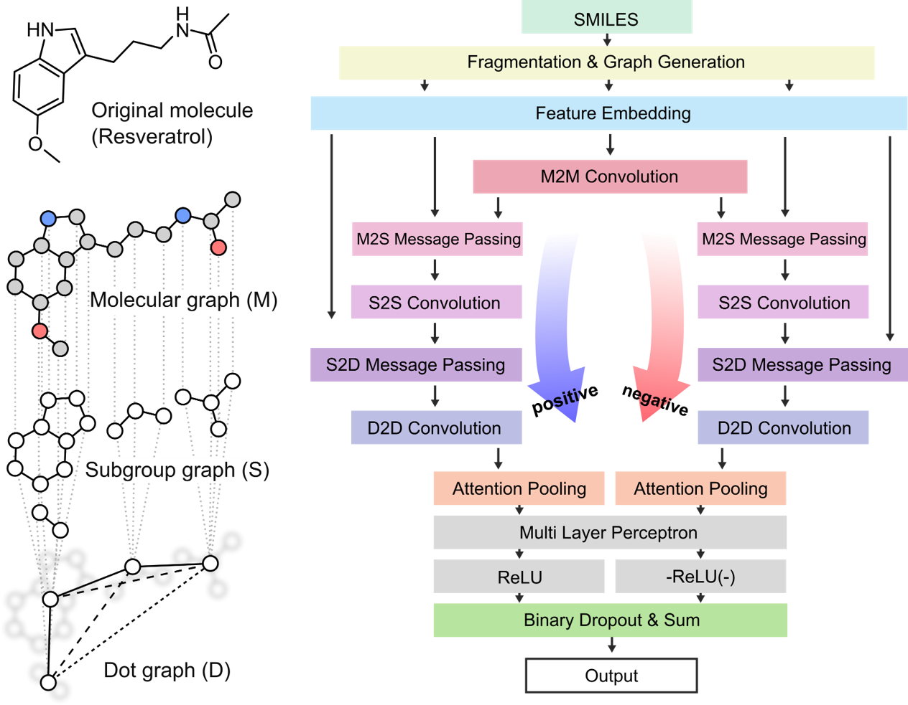
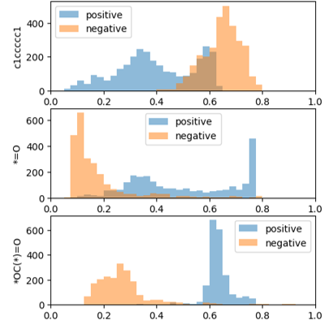

# Interpretable Subgraph Attention (ISA) network 
ISA network is intended to provide an interpretable analysis based on attention mechanism. This model mainly introduces two approaches to enhance interpretability, compared to conventional attention models.   
### Subgroup segmentation
Firstly, it supports versatile scale of subgroups using segmentation rule, and the researcher can customized the way of segmentation by varing the segmentation index parameter. Because the subgroups which are chemically related to the given property or which are intersting to researchers can be varied by the property and tasks, there needs to be a choice of subgroups for researchers.

### Positive & Negative (PN) attention
Conventional attention has no capacity to inform how the feature effects on the prediction result. PN attention was introduced to solve this limitation. In its two way of streams, the positive and negative contribution of subgroups are seperately trained. Then, the attention scores given by each stream (named as positive attention score (PAS) and negative attention score (NAS)) indicate which groups contribute positively or negatively on the property.

For effective analysis, it will be better to see the statistical score distribution, rather than the score of single moleucle. ISA Analyzer supports the simple statistical analysis through the dataset.

